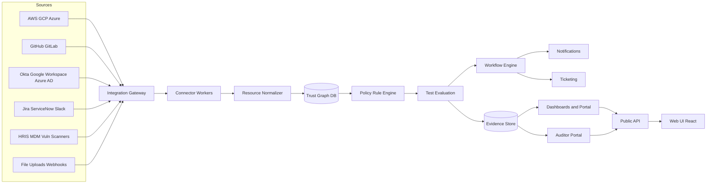

# End-to-End System Architecture

## Logical Components

## Component Responsibilities

### Integration Gateway
- Accepts inbound connections from OAuth, API keys, SCIM, webhooks, and file uploads.
- Handles token refresh, credential scoping, and region routing.
- Enforces rate limits and retries.

### Connector Workers
- One worker per connector type. Runs discovery, sync, and incremental updates.
- Transforms source-specific data into normalized resource records.
- Produces standardized events for `UserAccount`, `Computer`, `Vulnerability`, `TrainingRecord`, etc.

### Resource Normalizer
- Maps each source record into a canonical schema.
- Resolves identities across systems (e.g., Okta email == Google Workspace email == GitHub membership email).
- Stores the normalized Trust Graph.

### Trust Graph DB
- Stores tenants, organizations, resources, controls, frameworks, and mappings.
- Serves as the single source of truth for AI, tests, and dashboards.

### Policy / Rule Engine
- Evaluates declarative rules per resource.
- Supports built-in rules, custom rules, and joined rules across two resource types.
- Maintains rule versions and rollback.

### Test Evaluation
- Runs tests on schedule or on demand.
- Produces per-resource pass/fail with reasons and evidence.
- Rolls up results to control and framework status.

### Evidence Store
- Stores test results, resource snapshots, documents, and audit artifacts.
- Versions every change and maintains provenance.

### Workflow Engine
- Triggers notifications, remediation tasks, access reviews, and ticket creation.
- Tracks SLAs and escalations.

### Dashboards & Portal
- Real-time compliance posture, framework readiness, control owner views.
- Executive summaries, risk graphs, and task queues.

### Auditor Portal
- Read-only access for auditors.
- Supports information requests (IRs), evidence review, sampling, and comments.

### Public API
- Three separate surfaces:
  - Build Integrations API for inbound data.
  - Manage Vanta API for tenant automation.
  - Auditor API for audit firms.

## Data Flow
1. Administrator connects an integration using OAuth or an IAM role.
2. Connector worker pulls metadata on a schedule.
3. Data is normalized and written to the Trust Graph.
4. Rule engine evaluates each resource against mapped controls.
5. Test results and evidence snapshots are stored.
6. Status rolls up to framework and dashboard views.
7. Failures trigger workflows and remediation.
8. Auditors review evidence through the auditor portal.

## Deployment Modes
- SaaS multi-tenant with regional cells for US, EU, AU, Gov.
- Optional private integrations for on-prem/custom systems.
- Auditor access scoped per audit engagement.
