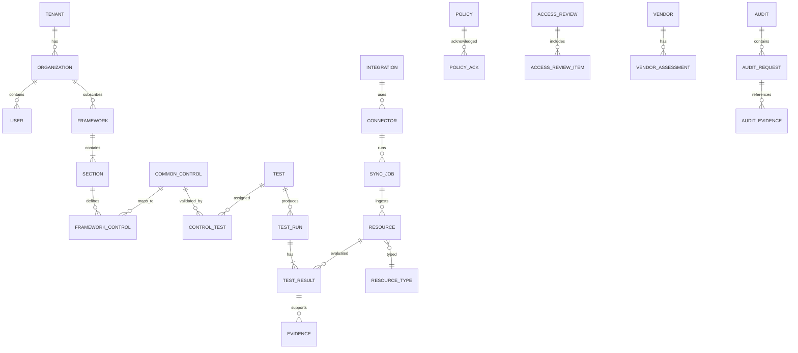

# Data Model and Entity Relationships

## Core Entities

## Table Descriptions

- `tenant`: top-level account. Isolates all data.
- `organization`: business unit or subsidiary within a tenant.
- `user`: employees, admins, auditors, owners.
- `role` and `permission`: RBAC definitions.
- `framework`: SOC 2, ISO 27001, HIPAA, GDPR, etc.
- `section`: framework clause (e.g., SOC 2 CC6.1).
- `common_control`: normalized control statement and domain.
- `framework_control`: framework-specific requirement and mapping to common controls.
- `control_test`: join table linking controls to tests.
- `test`: automated or manual test definition, rule, schedule.
- `test_run`: scheduled or ad-hoc execution snapshot.
- `test_result`: per-resource pass/fail and reason.
- `evidence`: artifact, snapshot, or document attached to a result.
- `integration`: connected system with credentials and settings.
- `connector`: type definition and schema for a source system.
- `sync_job`: scheduled or triggered ingestion job.
- `resource`: normalized record from an integration.
- `resource_type`: canonical schema for resources.
- `policy`: policy document version.
- `policy_ack`: employee acknowledgement record.
- `access_review` / `access_review_item`: access review campaigns and per-user/per-system decisions.
- `vendor` / `vendor_assessment`: third-party vendor and security questionnaire.
- `audit` / `audit_request` / `audit_evidence`: auditor engagement and information request workflow.

## Key Conventions
- Every table has `tenant_id` for row-level isolation.
- All timestamp fields use UTC.
- `external_id` stores the source-system identifier.
- Soft deletes preserve audit history.
- Evidence snapshots are immutable once written for a test run.

See `architecture/data-model.mmd` for the Mermaid source and `prototype/schema.sql` for a DDL starter.
